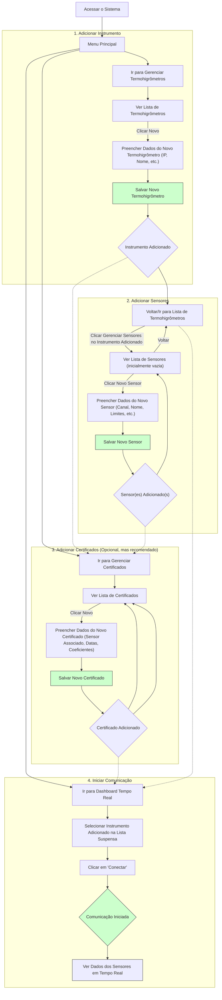

```mermaid
graph TD
    A[Acessar o Sistema] --> B[Menu Principal]

    subgraph "1. Adicionar Instrumento"
        B --> C[Ir para Gerenciar Termohigrômetros]
        C --> D[Ver Lista de Termohigrômetros]
        D -- Clicar Novo --> E["Preencher Dados do Novo Termohigrômetro (IP, Nome, etc.)"]
        E --> F[Salvar Novo Termohigrômetro]
        F --> G{Instrumento Adicionado}
    end

    subgraph "2. Adicionar Sensores"
        G --> H[Voltar/Ir para Lista de Termohigrômetros]
        H -- Clicar Gerenciar Sensores no Instrumento Adicionado --> I["Ver Lista de Sensores (inicialmente vazia)"]
        I -- Clicar Novo Sensor --> J["Preencher Dados do Novo Sensor (Canal, Nome, Limites, etc.)"]
        J --> K[Salvar Novo Sensor]
        K --> L{"Sensor(es) Adicionado(s)"}
        L --> I 
        I -- Voltar --> H
    end

    subgraph "3. Adicionar Certificados (Opcional, mas recomendado)"
        B --> M[Ir para Gerenciar Certificados]
        M --> N[Ver Lista de Certificados]
        N -- Clicar Novo --> O["Preencher Dados do Novo Certificado (Sensor Associado, Datas, Coeficientes)"]
        O --> P[Salvar Novo Certificado]
        P --> Q{Certificado Adicionado}
        Q --> N 
        Q --> N 
    end

    subgraph "4. Iniciar Comunicação"
        B --> R[Ir para Dashboard Tempo Real]
        R --> S[Selecionar Instrumento Adicionado na Lista Suspensa]
        S --> T[Clicar em 'Conectar']
        T --> U{Comunicação Iniciada}
        U --> V[Ver Dados dos Sensores em Tempo Real]
    end

    %% Links para indicar fluxo geral
    G -.-> M  
    L -.-> M  
    Q -.-> R  
    H -.-> R  

    %% Styling using class definitions to avoid hyphens
    classDef added fill:#ccffcc,stroke:#333,stroke-width:1;
    classDef highlight fill:#lightblue,stroke:#333,stroke-width:1;
    class F,K,P,U added;
    class V highlight;
```