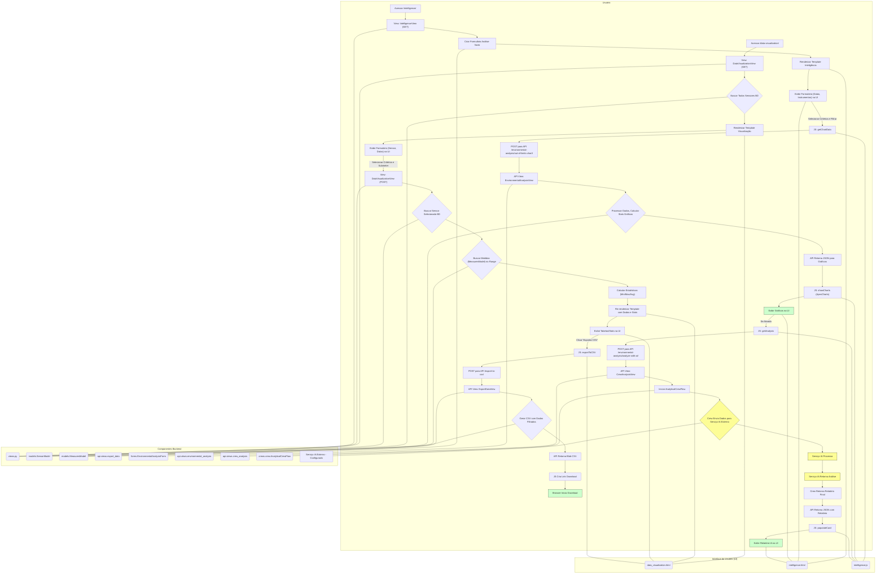

```mermaid
graph TD
    subgraph "Usuário"
        A["Acessar /data-visualization/"] --> B["View: DataVisualizationView (GET)"]
        B --> C{"Buscar Todos Sensores BD"}
        C --> D["Renderizar Template Visualização"]
        D --> E["Exibir Formulário (Sensor, Datas) na UI"]

        E -- "Selecionar Critérios e Submeter" --> F["View: DataVisualizationView (POST)"]
        F --> G{"Buscar Sensor Selecionado BD"}
        G --> H{"Buscar Medidas (MeasuresModel) no Range"}
        H --> I["Calcular Estatísticas (Min/Max/Avg)"]
        I --> J["Re-renderizar Template com Dados e Stats"]
        J --> K["Exibir Tabelas/Stats na UI"]

        K -- "Clicar 'Exportar CSV'" --> L["JS: exportToCSV"]
        L --> M["POST para API /export-to-csv/"]
        M --> N["API View: ExportDataView"]
        N --> O{"Gerar CSV com Dados Filtrados"}
        O --> P["API Retorna Blob CSV"]
        P --> Q["JS Cria Link Download"]
        Q --> R["Browser Inicia Download"]

        S["Acessar /intelligence/"] --> T["View: IntelligenceView (GET)"]
        T --> U["Criar Formulário Análise Vazio"]
        U --> V["Renderizar Template Inteligência"]
        V --> W["Exibir Formulário (Datas, Instrumentos) na UI"]

        W -- "Selecionar Critérios e Filtrar" --> X["JS: getChartData"]
        X --> Y["POST para API /environmental-analysis/out-of-limits-chart/"]
        Y --> Z["API View: EnvironmentalAnalysisView"]
        Z --> AA{"Processar Dados, Calcular Stats Gráficos"}
        AA --> BB["API Retorna JSON para Gráficos"]
        BB --> CC["JS: showCharts (ApexCharts)"]
        CC --> DD["Exibir Gráficos na UI"]

        DD -- "Se Ativado" --> EE["JS: getAnalysis"]
        EE --> FF["POST para API /environmental-analysis/analyze-with-ai/"]
        FF --> GG["API View: CrewAnalysisView"]
        GG --> HH["Iniciar AnalyticalCrewFlow"]
        HH --> II{"Crew Envia Dados para Serviço IA Externo"}
        II --> JJ["Serviço IA Processa"]
        JJ --> KK["Serviço IA Retorna Análise"]
        KK --> LL["Crew Retorna Relatório Final"]
        LL --> MM["API Retorna JSON com Relatório"]
        MM --> NN["JS: populateCard"]
        NN --> OO["Exibir Relatório IA na UI"]
    end

    subgraph "Componentes Backend"
        B --- PA("views.py")
        C --- PB("models.SensorModel")
        F --- PA
        G --- PB
        H --- PC("models.MeasuresModel")
        N --- PD("api.views.export_data")
        O --- PC
        T --- PA
        U --- PE("forms.EnvironmentalAnalysisForm")
        Z --- PF("api.views.environmental_analysis")
        AA --- PC
        GG --- PG("api.views.crew_analysis")
        HH --- PH("crews.crew.AnalyticalCrewFlow")
        II --- PI("Serviço IA Externo - Configurado")
    end

    subgraph "Interface do Usuário (UI)"
        D --- PJ("data_visualization.html")
        J --- PJ
        K --- PJ
        L --- PJ
        V --- PK("intelligence.html")
        W --- PK
        X --- PL("intelligence.js")
        CC --- PL
        DD --- PK
        EE --- PL
        NN --- PL
        OO --- PK
    end

    style R fill:#ccffcc,stroke:#333,stroke-width:1
    style DD fill:#ccffcc,stroke:#333,stroke-width:1
    style OO fill:#ccffcc,stroke:#333,stroke-width:1
    style II fill:#fdfd96,stroke:#333,stroke-width:1
    style JJ fill:#fdfd96,stroke:#333,stroke-width:1
    style KK fill:#fdfd96,stroke:#333,stroke-width:1
```