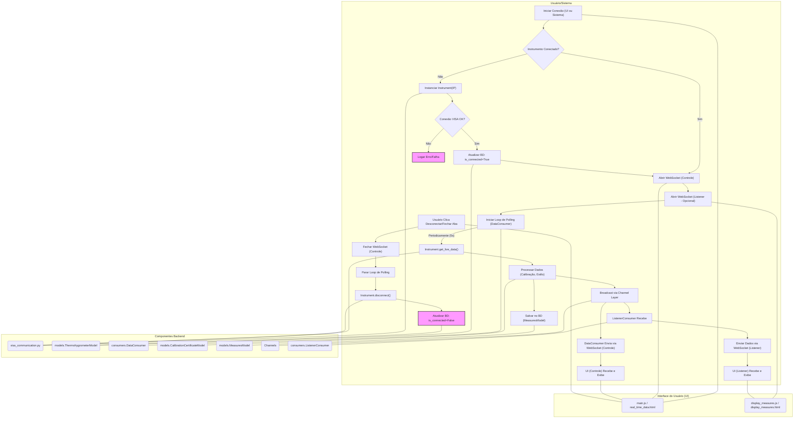

```mermaid
graph TD
    subgraph "Usuário/Sistema"
        A["Iniciar Conexão (UI ou Sistema)"] --> B{"Instrumento Conectado?"};
        B -- "Não" --> C["Instanciar Instrument(IP)"];
        B -- "Sim" --> D["Abrir WebSocket (Controle)"];
        C --> E{"Conexão VISA OK?"};
        E -- "Sim" --> F["Atualizar BD: is_connected=True"];
        E -- "Não" --> G["Logar Erro/Falha"];
        F --> D;
        D --> H["Abrir WebSocket (Listener - Opcional)"];
        H --> I["Iniciar Loop de Polling (DataConsumer)"];
        I -- "Periodicamente (5s)" --> J["Instrument.get_live_data()"];
        J --> K["Processar Dados (Calibração, Estilo)"];
        K --> L["Salvar no BD (MeasuresModel)"];
        K --> M["Broadcast via Channel Layer"];
        M --> N["ListenerConsumer Recebe"];
        N --> O["Enviar Dados via WebSocket (Listener)"];
        O --> P["UI (Listener) Recebe e Exibe"];
        M --> Q["DataConsumer Envia via WebSocket (Controle)"];
        Q --> R["UI (Controle) Recebe e Exibe"];
        S["Usuário Clica Desconectar/Fechar Aba"] --> T["Fechar WebSocket (Controle)"];
        T --> U["Parar Loop de Polling"];
        U --> V["Instrument.disconnect()"];
        V --> W["Atualizar BD: is_connected=False"];
    end

    subgraph "Componentes Backend"
        C --- X("visa_communication.py");
        F --- Y("models.ThermohygrometerModel");
        I --- Z("consumers.DataConsumer");
        J --- X;
        K --- AA("models.CalibrationCertificateModel");
        L --- BB("models.MeasuresModel");
        M --- CC("Channels");
        N --- DD("consumers.ListenerConsumer");
        V --- X;
        W --- Y;
    end

    subgraph "Interface do Usuário (UI)"
        A --- EE("main.js / real_time_data.html");
        D --- EE;
        H --- FF("display_measures.js / display_measures.html");
        P --- FF;
        R --- EE;
        S --- EE;
    end

    style G fill:#f9f,stroke:#333,stroke-width:2
    style W fill:#f9f,stroke:#333,stroke-width:2
```