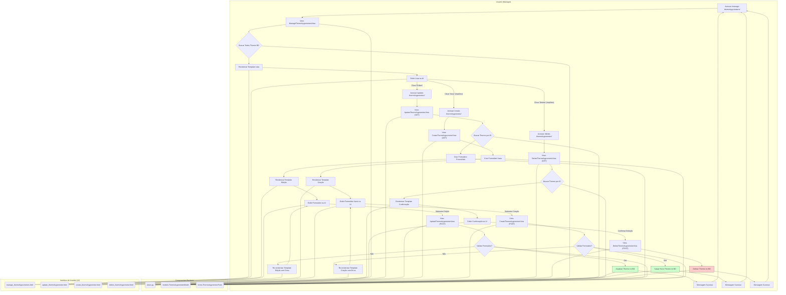

```mermaid
graph TD
    subgraph "Usuário (Manager)"
        A[Acessar /manage-thermohygrometers/] --> B[View: ManageThermohygrometersView]
        B --> C{Buscar Todos Thermo BD}
        C --> D[Renderizar Template Lista]
        D --> E[Exibir Lista na UI]

        E -- Clicar \'Editar\' --> F[Acessar /update-thermohygrometer/<id>/]
        F --> G["View: UpdateThermohygrometerView (GET)"]
        G --> H{"Buscar Thermo por ID"}
        H --> I[Criar Formulário Preenchido]
        I --> J[Renderizar Template Edição]
        J --> K[Exibir Formulário na UI]
        K -- Submeter Edição --> L["View: UpdateThermohygrometerView (POST)"]
        L --> M{Validar Formulário?}
        M -- Sim --> N[Atualizar Thermo no BD]
        N --> O[Mensagem Sucesso]
        O --> A
        M -- Não --> P[Re-renderizar Template Edição com Erros]
        P --> K

        E -- Clicar 'Novo' (Implícito) --> Q[Acessar /create-thermohygrometer/]
        Q --> R["View: CreateThermohygrometerView (GET)"]
        R --> S[Criar Formulário Vazio]
        S --> T[Renderizar Template Criação]
        T --> U[Exibir Formulário Vazio na UI]
        U -- Submeter Criação --> V["View: CreateThermohygrometerView (POST)"]
        V --> W{Validar Formulário?}
        W -- Sim --> X[Salvar Novo Thermo no BD]
        X --> Y[Mensagem Sucesso]
        Y --> A
        W -- Não --> Z[Re-renderizar Template Criação com Erros]
        Z --> U

        E -- Clicar 'Deletar' (Implícito) --> AA[Acessar /delete-thermohygrometer/<id>/]
        AA --> BB["View: DeleteThermohygrometerView (GET)"]
        BB --> CC{Buscar Thermo por ID}
        CC --> DD[Renderizar Template Confirmação]
        DD --> EE[Exibir Confirmação na UI]
        EE -- Confirmar Deleção --> FF["View: DeleteThermohygrometerView (POST)"]
        FF --> GG[Deletar Thermo no BD]
        GG --> HH[Mensagem Sucesso]
        HH --> A
    end

    subgraph "Componentes Backend"
        B --- II(views.py)
        C --- JJ(models.ThermohygrometerModel)
        G --- II
        H --- JJ
        I --- KK(forms.ThermohygrometerForm)
        L --- II
        M --- KK
        N --- JJ
        R --- II
        S --- KK
        V --- II
        W --- KK
        X --- JJ
        BB --- II
        CC --- JJ
        FF --- II
        GG --- JJ
    end

    subgraph "Interface do Usuário (UI)"
        D --- LL(manage_thermohygrometers.html)
        J --- MM(update_thermohygrometer.html)
        T --- NN(create_thermohygrometer.html)
        DD --- OO(delete_thermohygrometer.html)
        E --- LL
        K --- MM
        P --- MM
        U --- NN
        Z --- NN
        EE --- OO
    end

    style N fill:#ccffcc,stroke:#333,stroke-width:1
    style X fill:#ccffcc,stroke:#333,stroke-width:1
    style GG fill:#ffcccc,stroke:#333,stroke-width:1
```