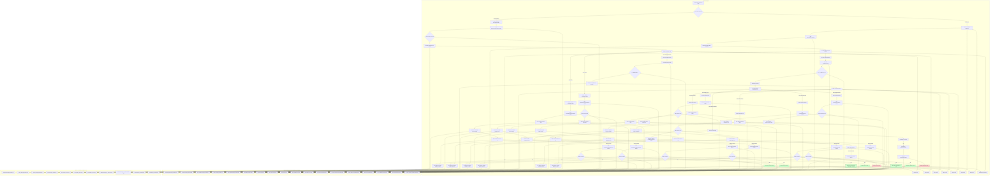

```mermaid
graph TD
    subgraph "Usuário (Manager)"
        A[Acessar Menu Principal ou Links] --> B{Qual Entidade Gerenciar?}

        B -- Termohigrômetros --> C[Acessar /manage-thermohygrometers/]
        C --> D[View: ManageThermohygrometersView]
        D --> E{Buscar Todos Thermo BD}
        E --> F[Renderizar Template Lista Thermo]
        F --> G[Exibir Lista Thermo na UI]

        G -- Clicar 'Novo' --> H[Acessar /create-thermohygrometer/]
        H --> I["View: CreateThermohygrometerView (GET)"]
        I --> J[Criar Formulário Thermo Vazio]
        J --> K[Renderizar Template Criação Thermo]
        K --> L[Exibir Formulário Vazio na UI]
        L -- Submeter Criação --> M["View: CreateThermohygrometerView (POST)"]
        M --> N{Validar Formulário?}
        N -- Sim --> O[Salvar Novo Thermo no BD]
        O --> P[Msg Sucesso] --> G
        N -- Não --> Q[Re-renderizar Template Criação com Erros] --> L

        G -- Clicar 'Editar' --> R[Acessar /update-thermohygrometer/<id>/]
        R --> S["View: UpdateThermohygrometerView (GET)"]
        S --> T{Buscar Thermo por ID}
        T --> U[Criar Formulário Thermo Preenchido]
        U --> V[Renderizar Template Edição Thermo]
        V --> W[Exibir Formulário Preenchido na UI]
        W -- Submeter Edição --> X["View: UpdateThermohygrometerView (POST)"]
        X --> Y{Validar Formulário?}
        Y -- Sim --> Z[Atualizar Thermo no BD]
        Z --> AA[Msg Sucesso] --> G
        Y -- Não --> BB[Re-renderizar Template Edição com Erros] --> W

        G -- Clicar 'Gerenciar Sensores' --> CC[Acessar /manage-sensors/<thermo_id>/]
        CC --> DD[View: ManageSensorsView]
        DD --> EE{Buscar Sensores do Thermo BD}
        EE --> FF[Renderizar Template Lista Sensores]
        FF --> GG[Exibir Lista Sensores na UI]

        GG -- Clicar 'Novo Sensor' --> HH[Acessar /create-sensor/<thermo_id>/]
        HH --> II["View: CreateSensorView (GET)"]
        II --> JJ[Criar Formulário Sensor Vazio]
        JJ --> KK[Renderizar Template Criação Sensor]
        KK --> LL[Exibir Formulário Vazio na UI]
        LL -- Submeter Criação --> MM["View: CreateSensorView (POST)"]
        MM --> NN{Validar Formulário?}
        NN -- Sim --> OO["Salvar Novo Sensor no BD (associado ao Thermo)"]
        OO --> PP[Msg Sucesso] --> GG
        NN -- Não --> QQ[Re-renderizar Template Criação com Erros] --> LL

        GG -- Clicar 'Editar Sensor' --> RR[Acessar /update-sensor/<id>/]
        RR --> SS["View: UpdateSensorView (GET)"]
        SS --> TT{Buscar Sensor por ID}
        TT --> UU[Criar Formulário Sensor Preenchido]
        UU --> VV[Renderizar Template Edição Sensor]
        VV --> WW[Exibir Formulário Preenchido na UI]
        WW -- Submeter Edição --> XX["View: UpdateSensorView (POST)"]
        XX --> YY{Validar Formulário?}
        YY -- Sim --> ZZ[Atualizar Sensor no BD]
        ZZ --> AAA[Msg Sucesso] --> GG
        YY -- Não --> BBB[Re-renderizar Template Edição com Erros] --> WW

        GG -- Clicar 'Deletar Sensor' --> CCC[Acessar /delete-sensor/<id>/]
        CCC --> DDD["View: DeleteSensorView (GET)"]
        DDD --> EEE{Buscar Sensor por ID}
        EEE --> FFF[Renderizar Template Confirmação Deleção Sensor]
        FFF --> GGG[Exibir Confirmação na UI]
        GGG -- Confirmar Deleção --> HHH["View: DeleteSensorView (POST)"]
        HHH --> III[Deletar Sensor no BD]
        III --> JJJ[Msg Sucesso] --> GG

        B -- Certificados --> KKK[Acessar /manage-certificates/]
        KKK --> LLL[View: ManageCertificatesView]
        LLL --> MMM[Renderizar Template Base Certificados]
        MMM --> NNN["JS: loadCertificates()"]
        NNN --> OOO[API GET /api/v1/certificates/]
        OOO --> PPP[API View: CertificateListView]
        PPP --> QQQ{Buscar Todos Certificados BD}
        QQQ --> RRR["API Response (JSON)"]
        RRR --> SSS[JS: Popular Tabela Certificados na UI]

        SSS -- Clicar 'Novo Certificado' --> TTT[Acessar /create-certificate/]
        TTT --> UUU["View: CreateCertificateView (GET)"]
        UUU --> VVV[Criar Formulário Certificado Vazio]
        VVV --> WWW[Renderizar Template Criação Certificado]
        WWW --> XXX[Exibir Formulário Vazio na UI]
        XXX -- Submeter Criação --> YYY["View: CreateCertificateView (POST)"]
        YYY --> ZZZ{Validar Formulário?}
        ZZZ -- Sim --> AAAA[Salvar Novo Certificado no BD]
        AAAA --> BBBB[Msg Sucesso] --> KKK
        ZZZ -- Não --> CCCC[Re-renderizar Template Criação com Erros] --> XXX

        SSS -- Clicar 'Editar Certificado' --> DDDD[Acessar /edit-certificate/<id>/]
        DDDD --> EEEE["View: UpdateCertificateView (GET)"]
        EEEE --> FFFF{Buscar Certificado por ID}
        FFFF --> GGGG[Criar Formulário Certificado Preenchido]
        GGGG --> HHHH[Renderizar Template Edição Certificado]
        HHHH --> IIII[Exibir Formulário Preenchido na UI]
        IIII -- Submeter Edição --> JJJJ["View: UpdateCertificateView (POST)"]
        JJJJ --> KKKK{Validar Formulário?}
        KKKK -- Sim --> LLLL[Atualizar Certificado no BD]
        LLLL --> MMMM[Msg Sucesso] --> KKK
        KKKK -- Não --> NNNN[Re-renderizar Template Edição com Erros] --> IIII

        SSS -- Clicar 'Deletar Certificado' --> OOOO["JS: deleteCertificate(id)"]
        OOOO --> PPPP[Confirmação do Usuário]
        PPPP -- Sim --> QQQQ[API DELETE /api/v1/certificates/<id>/]
        QQQQ --> RRRR[API View: CertificateDetailView]
        RRRR --> SSSS[Deletar Certificado no BD]
        SSSS --> TTTT["API Response (Success)"]
        TTTT --> NNN["JS: loadCertificates() para Refresh"]
    end

    subgraph "Componentes Backend (Views, Models, Forms, API)"
        D --- V_MT["views.ManageThermohygrometersView"]
        E --- M_T["models.ThermohygrometerModel"]
        I --- V_CT["views.CreateThermohygrometerView"]
        J --- F_T["forms.ThermohygrometerForm"]
        M --- V_CT
        N --- F_T
        O --- M_T
        S --- V_UT["views.UpdateThermohygrometerView"]
        T --- M_T
        U --- F_T
        X --- V_UT
        Y --- F_T
        Z --- M_T
        DD --- V_MS["views.ManageSensorsView"]
        EE --- M_S["models.SensorModel"]
        II --- V_CS["views.CreateSensorView"]
        JJ --- F_S["forms.SensorForm"]
        MM --- V_CS
        NN --- F_S
        OO --- M_S
        SS --- V_US["views.UpdateSensorView"]
        TT --- M_S
        UU --- F_S
        XX --- V_US
        YY --- F_S
        ZZ --- M_S
        DDD --- V_DS["views.DeleteSensorView"]
        EEE --- M_S
        HHH --- V_DS
        III --- M_S
        LLL --- V_MC["views.ManageCertificatesView"]
        PPP --- API_CLV["api.views.certificate.CertificateListView"]
        QQQ --- M_C["models.CalibrationCertificateModel"]
        UUU --- V_CC["views.CreateCertificateView"]
        VVV --- F_C["forms.CalibrationCertificateForm"]
        YYY --- V_CC
        ZZZ --- F_C
        AAAA --- M_C
        EEEE --- V_UC["views.UpdateCertificateView"]
        FFFF --- M_C
        GGGG --- F_C
        JJJJ --- V_UC
        KKKK --- F_C
        LLLL --- M_C
        RRRR --- API_CDV["api.views.certificate.CertificateDetailView"]
        SSSS --- M_C
    end

    subgraph "Interface do Usuário (Templates & JS)"
        F --- T_MT["manage_thermohygrometers.html"]
        K --- T_CT["create_thermohygrometer.html"]
        Q --- T_CT
        V --- T_UT["update_thermohygrometer.html"]
        BB --- T_UT
        FF --- T_MS["sensor/manage_sensors.html"]
        KK --- T_CS["sensor/create_sensor.html"]
        QQ --- T_CS
        VV --- T_US["sensor/update_sensor.html"]
        BBB --- T_US
        FFF --- T_DS["sensor/delete_sensor.html"]
        MMM --- T_MC["certificate/manage_all_certificates.html"]
        NNN --- JS_MC["certificate/manage_all_certificates.html - JS"]
        SSS --- JS_MC
        WWW --- T_CC["certificate/create_certificate.html"]
        CCCC --- T_CC
        HHHH --- T_EC["certificate/edit_certificate.html"]
        NNNN --- T_EC
        OOOO --- JS_MC
    end

    style O fill:#ccffcc,stroke:#333,stroke-width:1
    style Z fill:#ccffcc,stroke:#333,stroke-width:1
    style OO fill:#ccffcc,stroke:#333,stroke-width:1
    style ZZ fill:#ccffcc,stroke:#333,stroke-width:1
    style III fill:#ffcccc,stroke:#333,stroke-width:1
    style AAAA fill:#ccffcc,stroke:#333,stroke-width:1
    style LLLL fill:#ccffcc,stroke:#333,stroke-width:1
    style SSSS fill:#ffcccc,stroke:#333,stroke-width:1
```