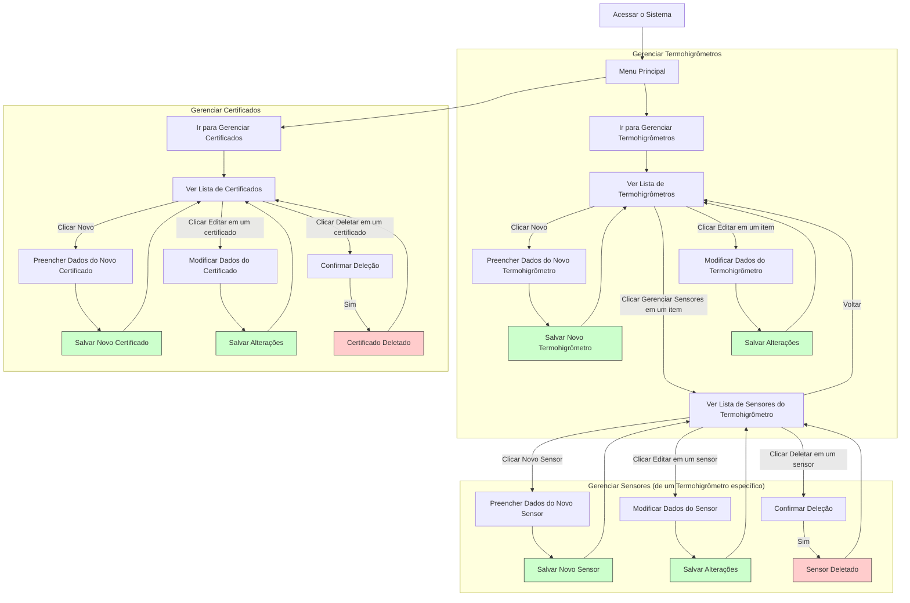

```mermaid
graph TD
    A[Acessar o Sistema] --> B[Menu Principal]

    subgraph "Gerenciar Termohigrômetros"
        B --> C[Ir para Gerenciar Termohigrômetros]
        C --> D[Ver Lista de Termohigrômetros]
        D -- Clicar Novo --> E[Preencher Dados do Novo Termohigrômetro]
        E --> F[Salvar Novo Termohigrômetro] --> D
        D -- Clicar Editar em um item --> G[Modificar Dados do Termohigrômetro]
        G --> H[Salvar Alterações] --> D
        D -- Clicar Gerenciar Sensores em um item --> I
    end

    subgraph "Gerenciar Sensores (de um Termohigrômetro específico)"
        I[Ver Lista de Sensores do Termohigrômetro]
        I -- Clicar Novo Sensor --> J[Preencher Dados do Novo Sensor]
        J --> K[Salvar Novo Sensor] --> I
        I -- Clicar Editar em um sensor --> L[Modificar Dados do Sensor]
        L --> M[Salvar Alterações] --> I
        I -- Clicar Deletar em um sensor --> N[Confirmar Deleção]
        N -- Sim --> O[Sensor Deletado] --> I
        I -- Voltar --> D
    end

    subgraph "Gerenciar Certificados"
        B --> P[Ir para Gerenciar Certificados]
        P --> Q[Ver Lista de Certificados]
        Q -- Clicar Novo --> R[Preencher Dados do Novo Certificado]
        R --> S[Salvar Novo Certificado] --> Q
        Q -- Clicar Editar em um certificado --> T[Modificar Dados do Certificado]
        T --> U[Salvar Alterações] --> Q
        Q -- Clicar Deletar em um certificado --> V[Confirmar Deleção]
        V -- Sim --> W[Certificado Deletado] --> Q
    end

    %% Link invisível para tentar forçar a ordem vertical
    H ~~~ I

    style F fill:#ccffcc,stroke:#333,stroke-width:1;
    style H fill:#ccffcc,stroke:#333,stroke-width:1;
    style K fill:#ccffcc,stroke:#333,stroke-width:1;
    style M fill:#ccffcc,stroke:#333,stroke-width:1;
    style O fill:#ffcccc,stroke:#333,stroke-width:1;
    style S fill:#ccffcc,stroke:#333,stroke-width:1;
    style U fill:#ccffcc,stroke:#333,stroke-width:1;
    style W fill:#ffcccc,stroke:#333,stroke-width:1;
```